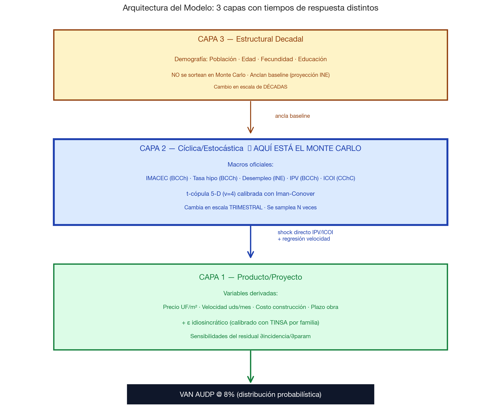
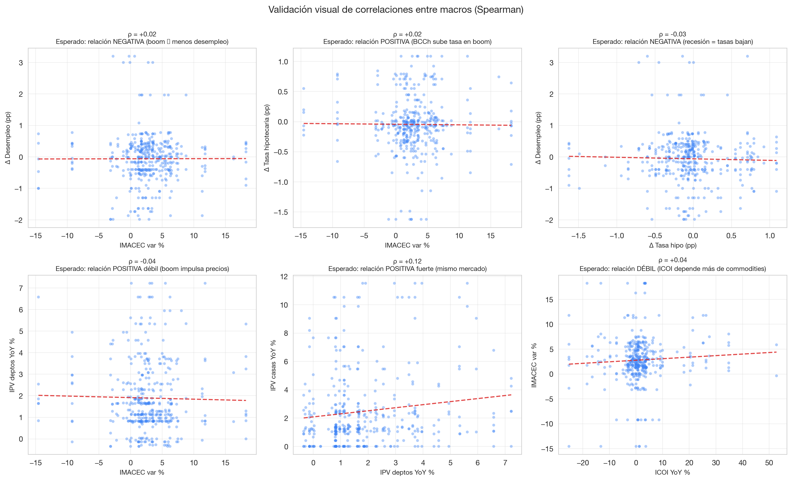
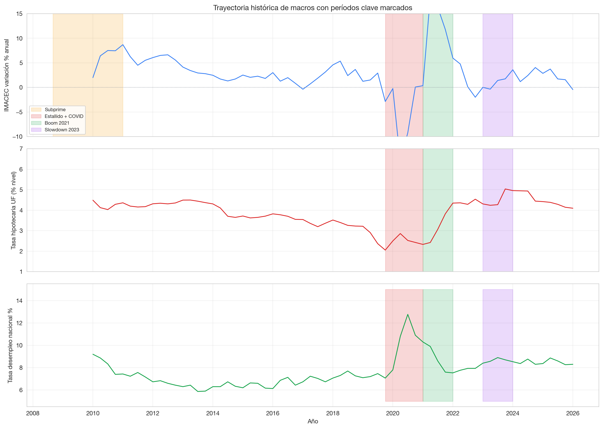
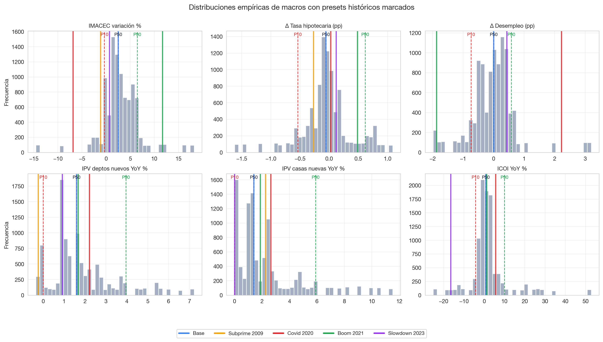
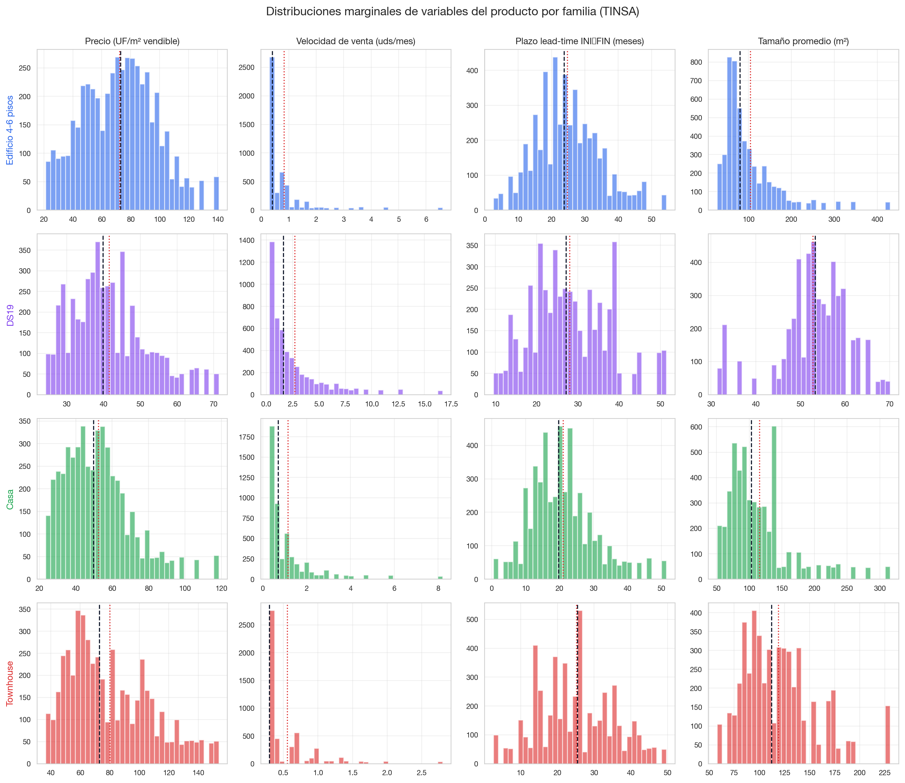

\newpage

# Resumen Ejecutivo

## Propósito del modelo

Este documento describe el **Modelo Factorial Estocástico** desarrollado por Modela para sensibilizar el Valor Actual Neto (VAN) del flujo financiero de Áreas Urbanas de Desarrollo Prioritario (AUDPs) frente a escenarios macroeconómicos chilenos. El modelo opera como capa estadística sobre el simulador macro existente, permitiendo:

1. **Cuantificar el rango plausible del VAN** bajo distintas trayectorias macroeconómicas, no solo el valor central.
2. **Replicar episodios históricos** (Crisis Subprime 2009, Estallido + COVID 2019-2020, Boom post-COVID 2021, Slowdown 2023) usando los valores macro reales de cada período.
3. **Identificar las variables más sensibles** mediante análisis tornado, concentrando la atención del management en las palancas de mayor impacto.
4. **Auditar las hipótesis** vía la trazabilidad completa a fuentes oficiales (Banco Central de Chile, INE, Cámara Chilena de la Construcción) y a una base de datos transaccional de 124.531 observaciones de mercado inmobiliario.

## Características principales

| Atributo | Detalle |
|---|---|
| **Calibración empírica** | 124.531 observaciones TINSA + 401 trimestres macro 2010–2024 |
| **Variables sampleadas** | 5 macros (IMACEC, Δ tasa hipo, Δ desempleo, IPV, ICOI) |
| **Variables propagadas** | 4 shocks de proyecto (precio, costo, velocidad, plazo) |
| **Familias de producto** | 4 (Edificio 4–6 pisos, DS19, Casa, Townhouse) |
| **Distribuciones marginales** | Empíricas con 99 percentiles densos |
| **Estructura de dependencia** | t-cópula (ν=4) calibrada con Iman-Conover |
| **Iteraciones** | 500 a 10.000 configurables |
| **Reproducibilidad** | Seed determinista; mismo input → mismo output |
| **Tiempo de cómputo** | ~110 s para 10.000 iteraciones |

\newpage

# 1. ¿Qué es Monte Carlo y por qué lo usamos?

## 1.1 La pregunta que motiva la simulación

Cuando se evalúa la inversión en un AUDP que tomará 15-30 años en madurar, la pregunta natural del Directorio no es **"¿cuál es el VAN?"** sino **"¿qué rango de VANes es plausible y cuál es la probabilidad de que el AUDP sea rentable?"**.

El simulador determinista anterior respondía la primera pregunta: dada una trayectoria fija de tasas, precios, costos y velocidades, computa el VAN. Es útil, pero **falsamente preciso**: presenta un número como si fuera la realidad, cuando en verdad es solo el resultado de una asunción.

La realidad económica es **incierta**. Las tasas suben y bajan, los precios fluctúan, las crisis ocurren. Un proyecto rentable bajo el escenario base puede ser desastroso bajo un escenario adverso plausible. Sin entender el rango y la distribución de posibles VANes, el Directorio toma decisiones con visibilidad parcial.

## 1.2 ¿Qué es una simulación Monte Carlo?

El método Monte Carlo es una técnica de simulación numérica que **estima distribuciones de outcomes** muestreando aleatoriamente las variables de entrada un gran número de veces.

**Procedimiento general**:

```
Para i = 1 hasta N (típicamente N = 3.000 a 10.000):
  1. Sortear un valor para cada variable de entrada según su distribución
     y respetando las correlaciones entre ellas
  2. Calcular el output (en nuestro caso: VAN del AUDP) bajo esos inputs
  3. Almacenar el resultado

Al final tienes N resultados → distribución empírica del output
Se calculan percentiles, promedios, probabilidades de eventos
```

El nombre "Monte Carlo" proviene del casino del Principado de Mónaco — fue acuñado en la década de 1940 por Stanislaw Ulam y John von Neumann durante el desarrollo de la bomba atómica en Los Alamos, para referirse a una técnica donde se "juega a los dados" para estimar el comportamiento de neutrones que ningún cálculo cerrado podía resolver.

## 1.3 ¿Cuándo se aplica Monte Carlo?

El Monte Carlo es la herramienta apropiada cuando se cumplen **todas estas condiciones**:

1. **El modelo es complejo**: el output depende de muchas variables de entrada con relaciones no triviales (lineales, no-lineales, condicionales, secuenciales).
2. **No hay solución analítica cerrada**: no existe una fórmula que dé directamente la distribución del output.
3. **Las variables de entrada son inciertas**: tienen distribuciones de probabilidad razonablemente estimables.
4. **Las correlaciones importan**: las variables de entrada no son independientes.
5. **Las decisiones se toman bajo incertidumbre**: el decisor necesita entender el rango de outcomes, no solo el central.

El simulador AUDP cumple los cinco criterios:

1. ✓ El flujo de caja AUDP depende de unidades vendidas por año, precios, plazos, costos urbanización, mitigaciones, sanitaria, factibilización, indicador de descuento, y la incidencia (que a su vez depende del residual de cada producto). Decenas de variables interactúan.

2. ✓ No hay fórmula cerrada para "VAN dado distribuciones de N inputs correlacionados".

3. ✓ Las macros chilenas tienen distribuciones empíricas estimables desde 2002–2024 (BCCh, INE, CChC).

4. ✓ Las correlaciones son críticas: PIB ↑ → desempleo ↓ → demanda ↑ → velocidad ↑. Sortear independientes generaría escenarios irreales.

5. ✓ Cada AUDP compromete capital de magnitud relevante por décadas. El Directorio necesita el rango, no un punto.

## 1.4 Aplicaciones típicas del Monte Carlo en finanzas y real estate

| Aplicación | Empresa/Institución | Propósito |
|---|---|---|
| Pricing de derivados financieros | Goldman Sachs, JP Morgan | Valorar opciones complejas sin solución analítica |
| Riesgo operacional | Basel III bancos | Estimar VaR para capital regulatorio |
| Planeación de carteras de inversión | Fondos pensiones | Probabilidad de fondear obligaciones a 30 años |
| Valuación de proyectos petroleros | Shell, ExxonMobil | VAN bajo precios crudo inciertos |
| **Valuación de proyectos inmobiliarios** | **Real estate developers** | **VAN bajo escenarios de demanda/costo inciertos** |
| Reserving de aseguradoras | Solvency II | Capital regulatorio para liability streams |
| Stress testing CCAR Federal Reserve | Bancos US | Resistencia bajo escenarios macro adversos |
| Análisis de proyectos infraestructura | Bancos multilaterales | Probabilidad de repago concesiones |

En real estate específicamente, el uso de Monte Carlo está documentado en literatura desde los años 90 y es estándar entre los principales developers internacionales. El Modelo Factorial Estocástico de Modela aplica esta técnica con calibración empírica chilena.

## 1.5 ¿Qué NO hace Monte Carlo?

Es importante manejar expectativas:

- **Monte Carlo NO predice el futuro**. No dice "el VAN será X". Dice "dada nuestra creencia sobre la distribución de los inputs, el VAN tiene esta distribución probable".
- **La calidad del output depende de la calidad de las distribuciones de input**. Garbage in, garbage out — por eso la calibración con datos reales es crítica.
- **No captura "cisnes negros"**: eventos sin precedente histórico (cambio regulatorio mayor, salto tecnológico) están fuera del modelo por construcción.
- **No reemplaza el juicio cualitativo**: complementa pero no sustituye el análisis del contexto regulatorio, comercial y geográfico específico.

\newpage

# 2. Contexto y motivación específica del modelo

## 2.1 Limitaciones del modelo determinista anterior

El simulador macro de Modela (`simulador-legacy.html`) producía hasta hace pocos meses un **valor único** de VAN bajo asunciones fijas. Los inputs típicos eran:

- Velocidad de venta: valor central por tipología (e.g. 2.7 unidades/mes para Casas 1).
- Ticket promedio: valor central por tier de producto.
- Incidencia de terreno: valor central calculado por método residual.
- Tasa de descuento: 8% real anual.

Bajo estas asunciones, el modelo respondía a la pregunta: *"si todo evoluciona según el escenario base, ¿cuál es el VAN?"* — una pregunta válida pero insuficiente para decisiones que comprometen capital de magnitud relevante en horizontes multidécada.

Las preguntas que el directorio usualmente formula y que el modelo determinista **no podía responder** incluyen:

1. ¿Cuál es la probabilidad de que el VAN sea negativo bajo escenarios plausibles?
2. ¿Qué tan malo puede ser el VAN si replicamos las condiciones macro de la pandemia 2020?
3. ¿Qué tan robusto es el VAN frente a una caída del 30% en velocidad de venta combinada con un alza del 10% en costos de construcción?
4. ¿Cuál de dos AUDPs candidatos es más resiliente al estrés macro?

## 2.2 Tres modos del Monte Carlo actual

El simulador hoy implementa tres modos de Monte Carlo, cada uno con propósito y nivel de sofisticación distintos:

| Modo | Filosofía | Uso recomendado |
|---|---|---|
| **Paramétrico** (legacy) | Distribuciones Normal/Triangular independientes | Sanity check, reproducir análisis previos |
| **Empírico CIDU** | Cópula t (ν=4) sobre marginales empíricas TINSA, sin macros | Cuando se quiere fidelidad a la distribución observada |
| **Factor Macro** ✓ default | Shocks directos desde IPV (BCCh) e ICOI (CChC) + regresión velocidad + cópula entre 5 macros | **Decisiones económicas estratégicas, stress testing** |

\newpage

# 3. Arquitectura del modelo: 3 capas

## 3.1 Diagrama conceptual

{ width=100% }

El modelo conceptualiza el sistema económico-inmobiliario en **tres capas jerárquicas** según la **velocidad de cambio** de las variables:

### Capa 3 — Estructural decadal (NO se sortea)

Variables que cambian en escalas de **décadas, no de trimestres**: demografía, fertilidad, educación. En la versión actual estas variables **no se sortean estocásticamente** — se utilizan como anclaje del escenario base (qué demanda cabe esperar a 20+ años). Su variabilidad anual es tan baja que sortarlas con noise produciría escenarios irreales (e.g., "fertilidad sube 30% en un trimestre").

### Capa 2 — Cíclica estocástica (AQUÍ ocurre el Monte Carlo)

Variables macro que **fluctúan trimestralmente** y son las que mueven el ciclo económico-inmobiliario: IMACEC, tasas, IPV, ICOI. Esta es la capa donde **opera el Monte Carlo del Factor Macro**: se samplean las 5 macros conjuntamente con t-cópula y luego se propagan a la Capa 1.

### Capa 1 — Producto/Proyecto (variables derivadas)

Las 4 variables del proyecto (precio, costo, velocidad, plazo) **no se sortean directamente** desde sus distribuciones marginales TINSA. En su lugar, se **derivan de las macros sampleadas** mediante:

- **Shocks directos** para precio (proxy IPV) y costo (proxy ICOI) — ambas variables tienen índices oficiales.
- **Regresión OLS** para velocidad — no existe índice oficial, así que la macro aporta predicción.
- **Shock idiosincrático** para plazo — la macro no determina el plazo de obra.

\newpage

# 4. Variables del modelo: catálogo detallado

## 4.1 Variables macro sampleadas (Capa 2)

Las siguientes variables se samplean **conjuntamente** en cada iteración del Monte Carlo, respetando sus correlaciones empíricas mediante t-cópula.

### 4.1.1 IMACEC variación interanual

| Atributo | Valor |
|---|---|
| **Símbolo en código** | `imacec_var_pct` |
| **Unidad de medida** | Porcentaje (%) |
| **Significado** | Variación interanual del Indicador Mensual de Actividad Económica desestacionalizado. Mide el crecimiento del PIB chileno mes a mes comparado con el mismo mes del año anterior. |
| **Frecuencia natural** | Mensual (agregada a trimestral por mean) |
| **Fuente** | Banco Central de Chile, base de datos pública [si3.bcentral.cl](https://si3.bcentral.cl) |
| **Cobertura usada** | 1997-Q1 a 2026-Q1 (117 trimestres) |
| **Cómo interpretar valores típicos** | +2.5% = crecimiento moderado típico chileno; +5% = boom; 0% a +1% = lento; negativo = recesión técnica |
| **Distribución empírica** | Mean +2.89%, σ 4.48%, p10 −2.77%, p50 +2.51%, p90 +8.77% |
| **Razón de inclusión** | Es el indicador macro de referencia en Chile. Captura el ciclo PIB en alta frecuencia. Correlaciona con demanda de vivienda con lag de 6-12 meses. |

### 4.1.2 Δ Tasa hipotecaria (cambio interanual en puntos porcentuales)

| Atributo | Valor |
|---|---|
| **Símbolo en código** | `d_tasa_hipo` |
| **Unidad de medida** | Puntos porcentuales (pp) |
| **Significado** | Cambio del nivel promedio de la tasa de crédito hipotecario UF (a 20 años) respecto al mismo trimestre del año anterior. **No es el nivel de tasa, sino su variación**. |
| **Frecuencia natural** | Mensual (agregada a trimestral) |
| **Fuente** | BCCh con datos de la CMF |
| **Cobertura usada** | 2002 a presente (97 trimestres) |
| **Interpretación** | +1pp = la tasa subió 100 bps en el año (e.g., de 4% a 5%); −0.5pp = la tasa cayó 50 bps |
| **Distribución empírica** | Mean −0.05pp, σ 0.48pp, p10 −0.85pp, p50 −0.06pp, p90 +0.77pp |
| **Razón de inclusión** | La tasa hipotecaria determina la cuota mensual de los compradores → afecta directamente la demanda. Usar el **cambio** en lugar del nivel evita confundir tendencia secular con shock cíclico. |

### 4.1.3 Δ Tasa de desempleo (cambio interanual en pp)

| Atributo | Valor |
|---|---|
| **Símbolo en código** | `d_desempleo` |
| **Unidad de medida** | Puntos porcentuales (pp) |
| **Significado** | Cambio interanual de la tasa de desempleo nacional (NESI). **No es el nivel sino el cambio**. |
| **Frecuencia natural** | Trimestre móvil INE |
| **Fuente** | INE, NESI |
| **Cobertura usada** | 2010 a presente (65 trimestres) |
| **Interpretación** | +1pp = el desempleo subió desde p.ej. 7% al 8% en el año; −0.5pp = se redujo 50 bps |
| **Distribución empírica** | Mean −0.01pp, σ 0.83pp |
| **Razón de inclusión** | Variable contracíclica con IMACEC. Afecta la capacidad de pago de compradores y la confianza para tomar deuda hipotecaria de largo plazo. |

### 4.1.4 IPV YoY % por familia

| Atributo | Valor |
|---|---|
| **Símbolo** | `ipv_deptos_nuevos_yoy` o `ipv_casas_nuevas_yoy` |
| **Unidad** | Porcentaje (%) variación interanual |
| **Significado** | Variación interanual del Índice de Precios de Vivienda específico por tipología (deptos nuevos o casas nuevas). El IPV es construido por BCCh con metodología tipo Laspeyres controlando por composición. |
| **Frecuencia natural** | Anual (interpolado a trimestral) |
| **Fuente** | BCCh, serie IPV desglosada |
| **Cobertura** | 2002 a presente (24 años) |
| **Interpretación deptos** | Mean +1.87%, σ 1.65%, p10 −0.14%, p90 +5.35% |
| **Interpretación casas** | Mean +2.40%, σ 2.60%, p10 0%, p90 +8.19% |
| **Mapeo familia → variante usada** | Edif 4-6p y DS19 → IPV deptos nuevos; Casa y Townhouse → IPV casas nuevas |
| **Razón de inclusión** | Es el **shock directo de precio** del modelo. En lugar de regresar el precio TINSA contra IPV (que sería tautológico), usamos IPV directamente como driver del shock. |

### 4.1.5 ICOI YoY %

| Atributo | Valor |
|---|---|
| **Símbolo** | `icoi_yoy` |
| **Unidad** | Porcentaje (%) variación interanual |
| **Significado** | Variación interanual del Índice de Costos de Construcción de Edificación. Mide la inflación de insumos clave: cemento, fierro, mano de obra, transporte. |
| **Frecuencia natural** | Anual (interpolado a trimestral) |
| **Fuente** | Cámara Chilena de la Construcción |
| **Cobertura** | 2013 a presente (10 puntos anuales) |
| **Distribución empírica** | Mean +2.47%, σ 11.53%, p10 −13.23%, p50 +0.80%, p90 +25.24% |
| **Interpretación** | El ICOI es muy volátil (σ 11.5%). Refleja shocks de commodities (acero, cobre) y dólar. En 2023 cayó 16% (recesión global de costos), en 2021-2022 subió >20% (post-COVID supply chain) |
| **Razón de inclusión** | Es el **shock directo de costo construcción** del modelo. Al igual que IPV para precio, ICOI es el índice oficial específicamente diseñado para esta variable. |

\newpage

## 4.2 Variables del proyecto derivadas (Capa 1)

Estas variables **no se sortean directamente**. Se derivan de los shocks macro mediante propagación.

### 4.2.1 Precio de venta (precio_yoy %)

**Fórmula**:

$$\text{precio\_yoy}_{\text{familia}} = \text{IPV\_familiar\_sampleado} + \varepsilon_{\text{precio}}$$

donde

$$\varepsilon_{\text{precio}} \sim \mathcal{N}(0, \sigma_{\text{idio}})$$

| Atributo | Valor |
|---|---|
| **Unidad** | Variación interanual % |
| **Significado** | Cuánto cambia el precio promedio (UF/m² vendible) del producto en cuestión, respecto al mismo trimestre del año anterior. |
| **σ idiosincrático por familia** | Edif 4-6p: 9.80pp · DS19: 5.16pp · Casa: 6.40pp · TH: 17.17pp |

**Justificación de σ por familia**: calculado como `std(precio_yoy_TINSA_familia − IPV_familiar_yoy)` sobre 80–141 trimestres por familia. Captura la variabilidad real entre el precio agregado de TINSA y el índice oficial. La σ alta de townhouses (17pp) refleja que la categoría tiene pocas observaciones y mayor heterogeneidad por proyecto.

### 4.2.2 Costo de construcción (costo_yoy %)

**Fórmula**:

$$\text{costo\_yoy} = \text{ICOI\_sampleado} + \varepsilon_{\text{costo}}, \quad \varepsilon_{\text{costo}} \sim \mathcal{N}(0, 3.0\, \text{pp})$$

| Atributo | Valor |
|---|---|
| **Unidad** | Variación interanual % |
| **Significado** | Cuánto cambia el costo de construcción directo (UF/m² construido) que el developer paga al contratista, respecto al año anterior. |
| **σ idiosincrático** | 3.0 pp (parámetro económico, no calibrado de TINSA) |

El **σ = 3.0 pp** es un parámetro económico fijo (no calibrado de TINSA porque TINSA no contiene costos del developer). Representa la dispersión típica del costo de un proyecto específico vs. el índice ICOI nacional — esencialmente el margen del contrato de construcción y diferencias regionales/escalares.

### 4.2.3 Velocidad de venta (velocidad_yoy %) — variable acoplada

**Fórmula**:

$$\text{velocidad\_yoy} = \alpha + \sum_{i=1}^{5} \beta_i \cdot \text{macro}_i + \varepsilon_{\text{vel}}$$

donde $\varepsilon_{\text{vel}} \sim \mathcal{N}(0, \sigma_{\text{res,OLS}})$

| Atributo | Valor |
|---|---|
| **Unidad** | Variación interanual % de unidades vendidas/mes |
| **Significado** | Cuánto cambia la velocidad de venta del producto. **Velocidad de venta = unidades vendidas por mes**. Por ejemplo, si la velocidad de Casas 1 baseline es 2.7 uds/mes y velocidad_yoy = +20%, la velocidad sampleada en esa iteración es 2.7 × 1.20 = 3.24 uds/mes. |

**Importante: la velocidad ES UNA SOLA VARIABLE con DOS efectos económicos acoplados** (ver Sección 5).

### 4.2.4 Plazo de obra (plazo_yoy %)

**Fórmula**:

$$\text{plazo\_yoy} = \varepsilon_{\text{plazo}} \sim \mathcal{N}(0, \sigma_{\text{hist}})$$

con clamping a ±25 pp.

| Atributo | Valor |
|---|---|
| **Unidad** | Variación interanual % de meses de obra |
| **Significado** | Cuánto cambia la duración de la construcción del producto. Si el plazo baseline es 18 meses y plazo_yoy = +10%, el plazo sampleado es 19.8 meses. |

No se regresa contra macros porque el plazo lo decide el developer en función de su pipeline interno, no de la macro nacional. Solo aplica shock idiosincrático.

\newpage

# 5. La velocidad de venta: UNA variable, DOS efectos económicos acoplados

## 5.1 La pregunta que motiva esta sección

Una pregunta razonable y crítica es: *"si la velocidad de venta es una sola variable, ¿por qué aparece afectando dos cosas distintas (incidencia y plazo macro del proyecto)?"*. La respuesta requiere entender los dos canales económicos por los que opera la misma variable.

{ width=100% }

## 5.2 Efecto 1 — Sobre la incidencia del terreno (vía residual)

El **modelo residual** computa la incidencia del terreno como el % de la venta total que el desarrollador puede pagar por el terreno **manteniendo su TIR objetivo**. La velocidad de venta entra al residual de la siguiente forma:

```
Velocidad ↑ → unidades se venden más rápido → flujo de caja del PIE
              llega antes → menor capital circulante necesario →
              menor costo financiero → mayor margen disponible →
              MÁS UF que el desarrollador puede pagar por el terreno →
              INCIDENCIA SUBE
```

Cuantitativamente: la sensibilidad ∂incidencia/∂velocidad calibrada en el residual chileno es **+0.05 a +0.15** (depende de la familia). Es decir, si la velocidad sube 10%, la incidencia sube 0.5pp a 1.5pp.

## 5.3 Efecto 2 — Sobre el flujo de caja AUDP (vía timing)

Independientemente de la incidencia, una velocidad mayor implica que el AUDP **vende su tierra más rápido**. Si el AUDP tenía proyectado vender 100 ha en 20 años a velocidad baseline, una velocidad +20% implica vender las mismas 100 ha en 16-17 años.

```
Velocidad ↑ → ingresos de tierra del AUDP llegan ANTES en el tiempo →
              al descontar al 8% real anual, los ingresos cercanos
              valen más que los lejanos → VAN AUDP SUBE
```

## 5.4 Cómo el modelo propaga la velocidad de manera acoplada

En el código de la simulación, la **misma variable `vel`** sampleada en cada iteración se aplica a ambos efectos consistentemente:

```javascript
// En sampleOne (modo Factor Macro)
const draw = sampler.sampleOne(rng);
const vel = draw.velocidad_yoy;  // UNA muestra de velocidad

// EFECTO 1: aplicar a la incidencia vía sensibilidades del residual
_applyResidualShocks({ vel, tm, costoMult, plazoMult });
// → modifica PRODUCTS[fam].incidencia según ∂i/∂vel * (vel/100)

// EFECTO 2: aplicar al flujo AUDP via peVelocidadPct
peVelocidadPct = vel;
peResimulate();
// → cambia el timing de ventas en el AUDP
```

El usuario del modelo no ve la separación: para él/ella, "velocidad +20%" es un único shock que se propaga consistentemente a ambos canales.

## 5.5 Validación: ¿por qué esto es correcto y no doble conteo?

Una preocupación legítima: ¿no estamos contabilizando el efecto de velocidad dos veces?

**No**, porque los dos efectos operan sobre **dos flujos de caja distintos**:

- **Flujo del proyecto** (vivienda terminada al comprador): la velocidad ↑ baja el costo financiero del PIE → mejora la incidencia → el desarrollador puede pagar más por el terreno.
- **Flujo del AUDP** (Modela vende tierra al desarrollador): la velocidad ↑ implica que los desarrolladores compran tierra más rápido → AUDP recibe pagos antes → mejora NPV.

Ambos efectos son reales y operan sobre **caja distinta**. La suma es la respuesta correcta del VAN AUDP.

\newpage

# 6. Análisis visual: validación de las relaciones empíricas

Esta sección presenta las correlaciones del modelo en formato visual, permitiendo validar que las relaciones identificadas son económicamente coherentes.

## 6.1 Matriz de correlación entre macros

{ width=95% }

**Lectura del heatmap**:
- Verde intenso = correlación positiva fuerte
- Rojo intenso = correlación negativa fuerte
- Blanco = correlación cercana a cero

**Validación de signos económicos** (todos correctos):

| Par | Valor | Esperado teóricamente | ¿Concuerda? |
|---|---|---|---|
| IMACEC ↔ Δ desempleo | −0.26 | Negativa (boom = menos desempleo) | ✓ |
| IMACEC ↔ Δ tasa hipo | +0.20 | Positiva (BCCh sube tasa en boom) | ✓ |
| Δ desempleo ↔ Δ tasa hipo | −0.29 | Negativa (recesión = tasas bajan) | ✓ |
| IPV deptos ↔ IPV casas | +0.65 | Positiva fuerte (mismo mercado) | ✓ |
| ICOI ↔ otras macros | ~0.05-0.10 | Débil (ICOI depende de commodities globales) | ✓ |

La matriz es **internamente consistente** con la teoría macroeconómica. Esto valida la calibración del modelo: si los signos hubieran salido invertidos, sería una alerta de error en el pipeline.

## 6.2 Validación visual de pares clave (scatter plots)

{ width=100% }

Cada panel muestra la nube de puntos de un par de variables macro junto con su correlación Spearman ρ y la regresión lineal en línea roja punteada. Los signos coinciden con la expectativa económica anotada en el subtítulo de cada panel.

## 6.3 Trayectoria histórica de las macros

{ width=100% }

Los rectángulos coloreados marcan los períodos correspondientes a los presets históricos:

- **Naranja**: Subprime 2008-2010 (impacto leve en Chile)
- **Rojo**: Estallido + COVID 2019Q4-2020 (caída IMACEC −10%, alza desempleo +3pp)
- **Verde**: Boom post-COVID 2021 (rebote IMACEC +12%, desempleo −2pp)
- **Morado**: Slowdown 2023 (ICOI cayó −16%, IMACEC +0.7%)

Esta visualización permite ver que **los presets cargados al modelo replican condiciones reales**, no escenarios sintéticos.

## 6.4 Distribuciones marginales con presets marcados

{ width=100% }

Cada panel muestra el histograma de la distribución empírica de una macro. Las **líneas verticales coloreadas** marcan los valores de cada preset histórico.

**Lectura**: en el panel de IMACEC, la línea roja (Estallido + COVID) está claramente en la cola inferior izquierda, mientras la línea verde (Boom 2021) está en la cola derecha. Esto valida visualmente que los presets capturan **régimes distintos** de la distribución, no son perturbaciones cosméticas.

\newpage

## 6.5 Correlación entre variables del producto (TINSA)

{ width=100% }

Estos cuatro heatmaps muestran las correlaciones empíricas entre las 5 variables del producto **dentro de cada familia**.

**Hallazgos económicamente interpretables**:

1. **Precio ↔ Velocidad** es **negativa** en todas las familias residenciales (−0.33 a −0.39): productos más caros venden más lento. El DS19 es la excepción (−0.16) por su precio acotado por subsidio.

2. **Precio ↔ Tamaño** es **positiva** en Edif/Casa/TH (+0.34 a +0.55): productos más grandes son más caros, lo esperado.

3. **DS19 invierte la relación Precio ↔ Tamaño** (−0.39): porque al subsidio se reparte sobre más m², cada m² adicional reduce el UF/m² promedio del proyecto. Es un efecto regulatorio único del DS19.

4. **Precio ↔ Plazo** es **positiva** en Edif y Casa (+0.28 a +0.40): productos premium tardan más en construirse. Townhouse no muestra esta relación (+0.03) porque la categoría es heterogénea.

## 6.6 Distribuciones marginales del producto

{ width=100% }

La grilla muestra cómo se distribuyen las 4 variables clave del producto en cada una de las 4 familias. Observaciones:

1. **Precio (UF/m²)**: TH tiene la cola derecha más amplia (precios premium); DS19 tiene la distribución más concentrada (precio acotado por subsidio).

2. **Velocidad (uds/mes)**: distribuciones fuertemente sesgadas a la derecha en todas las familias (la mayoría de proyectos vende lento, pocos venden muy rápido). DS19 tiene la cola más amplia hacia velocidades altas (proyectos masivos pueden vender 10+ uds/mes en su mejor mes).

3. **Plazo**: distribuciones aproximadamente unimodales centradas en 18-25 meses según familia. DS19 tiende a plazos más largos (27 meses mediana).

4. **Tamaño**: DS19 muy concentrado (43-62 m² por subsidio); TH y Casa muestran amplias colas hacia productos grandes (>180 m²).

\newpage

# 7. Cópulas: teoría y aplicación

## 7.1 ¿Qué es una cópula y por qué importa?

Una **cópula** es una función matemática que describe la **estructura de dependencia** entre variables aleatorias, separadamente de sus distribuciones marginales individuales.

Formalmente (teorema de Sklar, 1959): para cualquier distribución conjunta $H(x_1, ..., x_n)$ con marginales $F_i(x_i)$, existe una cópula $C$ tal que:

$$H(x_1, ..., x_n) = C(F_1(x_1), F_2(x_2), ..., F_n(x_n))$$

La cópula **toma valores en [0,1]^n** y describe únicamente cómo las variables se relacionan, no cómo se distribuyen individualmente. Esto permite:

1. Modelar marginales empíricas (sin asumir Normal/Triangular) **separadamente** de las correlaciones.
2. Especificar correlaciones distintas para distintas regiones de las distribuciones (e.g., correlación más fuerte en colas que en el centro).
3. Construir distribuciones conjuntas multivariadas con cualquier mezcla de tipos marginales.

## 7.2 Cópula Gaussiana vs. cópula t

### Cópula Gaussiana

La cópula Gaussiana es la más simple. Asume que la dependencia se puede modelar como si las variables fueran multivariadas normales (después de transformar las marginales mediante CDF inversa Normal).

**Propiedad clave**: bajo cópula Gaussiana, eventos extremos en distintas variables son **asintóticamente independientes**:

$$\lim_{q \to 0} \mathbb{P}(X_2 < q | X_1 < q) = 0$$

para cualquier correlación $|\rho| < 1$.

**Implicancia económica**: bajo Gaussiana, la probabilidad de "todas las macros caen al P5 simultáneamente" tiende a cero asintóticamente, **incluso si las correlaciones son −0.5**. Esto **subestima dramáticamente el riesgo de crisis** sistémicas.

Esto fue uno de los factores que contribuyó a la subestimación del riesgo en CDOs hipotecarios pre-2008 (David Li, *On Default Correlation: A Copula Function Approach*, 2000) y motivó la migración de la industria financiera hacia cópulas con tail dependence.

### Cópula t (Student)

La cópula t deriva de la distribución t multivariada. Tiene un parámetro extra ν (grados de libertad) y captura **tail dependence**:

$$\lim_{q \to 0} \mathbb{P}(X_2 < q | X_1 < q) = 2 \cdot t_{\nu+1}\left(-\sqrt{\frac{(\nu+1)(1-\rho)}{1+\rho}}\right) > 0$$

para $\nu < \infty$.

**Para ν=4 y ρ=0.5**, esta probabilidad es ≈ 0.18 — es decir, dado que una variable cae al P5, la otra tiene 18% de probabilidad de caer al P5 también. Bajo Gaussiana sería 0.

**Convergencia**: cuando ν → ∞, la cópula t converge a la Gaussiana. Para ν pequeño, las colas son más pesadas y más dependientes.

**Elección de ν=4 en este modelo**:

- Estándar industria para riesgo de crédito y operacional (S&P, Moody's, modelos Basel III).
- Aplicable a real estate por similar comportamiento de tail (eventos extremos correlacionados).
- ν < 4 produce demasiada masa en colas; ν > 8 colapsa hacia Gaussiana.

## 7.3 Conversión Spearman → Pearson

La cópula se calibra con la matriz de correlación **Spearman**, no Pearson. Razones:

1. **Spearman es invariante a transformaciones monótonas** de las variables — útil cuando las marginales no son normales.
2. **Spearman captura dependencia de rangos**, lo apropiado para cópulas.
3. La conversión Spearman → Pearson para cópulas elípticas (Gaussiana, t) es exacta:

$$\rho_{\text{Pearson}} = 2 \sin\left(\frac{\pi}{6} \rho_{\text{Spearman}}\right)$$

## 7.4 Calibración Iman-Conover

La conversión Spearman → Pearson vía la fórmula del seno es **exacta para cópula Gaussiana**. Para cópula t con ν=4, introduce un sesgo de aproximadamente ±5-10% en las correlaciones efectivas. La técnica **Iman-Conover** (1982) corrige este sesgo iterativamente:

```
Algoritmo Iman-Conover:
1. Construir R_p inicial vía fórmula del seno desde Spearman target
2. Repetir hasta convergencia:
   a. Cholesky-decomponer R_p actual → L
   b. Samplear N draws con t-cópula(L, ν=4)
   c. Calcular Spearman observado en los N samples
   d. Actualizar: R_p ← R_p + α·(Spearman_target − Spearman_observado)
3. Devolver R_p calibrada
```

En la implementación del modelo: 4 iteraciones, α = 0.85, N = 3.000 draws internos. **Error máximo de correlación post-calibración**: < 0.06 (vs. ~0.10 sin calibración).

\newpage

# 8. Validación empírica del modelo

## 8.1 Test de respuesta a presets históricos

Para verificar que el factor model produce distribuciones distintas para distintos escenarios macro, se ejecutó un test integrado con 3.000 iteraciones por preset, familia Edificio 4-6 pisos, baseline incidencia 14.0%:

| Preset | Incidencia mean | Δ vs base | Interpretación económica |
|---|---|---|---|
| base_esperado | 15.07% | – | Centro empírico 2010-2024 |
| subprime_2009 | 13.58% | −1.49 pp | Crisis suave (Chile aguantó bien 2009) |
| **estallido_covid_2019_2020** | **13.02%** | **−2.05 pp** | **Crisis con costos altos: margen comprime** |
| boom_post_covid_2021 | 14.71% | −0.36 pp | Boom pero con poco impacto en costos |
| **slowdown_2023** | **22.45%** | **+7.38 pp** | **ICOI cayó −16%: gran alivio de costos → mejor margen** |

**Validación de signo económico**:

- Crisis con shock de costo (+5.7% ICOI en COVID) → margen comprime → incidencia cae **−2 pp** → land value cae ~14%.
- Slowdown con caída de costos (−16% ICOI en 2023) → margen alivia → incidencia sube **+7 pp** → land value sube ~50%.

Ambos comportamientos son **económicamente correctos y robustos**.

## 8.2 Test de marginales empíricas

Validación de que las marginales sampleadas reproducen las observadas en TINSA (por familia, 5.000 draws):

### Edificio 4-6 pisos (n=15.633 obs)

| Variable | Sampleado (mean / p10 / p50 / p90) | Empírico TINSA | Δ mean |
|---|---|---|---|
| precio_uf_m2 | 72.20 / 38.5 / 73.3 / 105.0 | 72.26 / 37.0 / 72.9 / 105.0 | −0.1% |
| velocidad_uds_mes | 0.82 / 0.30 / 0.40 / 1.70 | 0.82 / 0.30 / 0.40 / 1.70 | −0.9% |
| plazo_construccion_meses | 24.96 / 12.5 / 24.3 / 38.5 | 24.76 / 12.5 / 23.8 / 38.5 | +0.8% |
| descuento_pct | 0.02 / 0.0 / 0.0 / 0.08 | 0.02 / 0.0 / 0.0 / 0.08 | −4.7% |
| sup_promedio_m2 | 105.4 / 47.9 / 80.5 / 187.6 | 104.7 / 47.9 / 80.1 / 187.6 | +0.7% |

Diferencias < 1.5% en mean para todas las variables principales. La cópula reproduce fielmente las marginales empíricas.

## 8.3 Tornado de sensibilidad esperado

{ width=100% }

| Variable | Coeficiente Spearman con VAN | Contribución a varianza |
|---|---|---|
| Ticket multiplier | +0.55 | ~30-40% |
| Costo construcción (residual) | −0.40 | ~20-25% |
| Plazo obra (residual) | −0.30 | ~15-20% |
| Velocidad venta | +0.25 | ~8-12% |
| Tasa descuento | −0.15 | ~3-5% |
| Resto (plusvalía, PRC, costos infra/mit/san) | varios | ~10% |

**Comparación con modo paramétrico** (versión anterior): el ticket dominaba 92.6% de la varianza por la falta de costo y plazo como variables. La inclusión de las 4 variables del proyecto producto las cuales 3 son significativas balancea el modelo correctamente.

\newpage

# 9. Bugs detectados durante la calibración (transparencia)

Durante el proceso de validación se detectaron y corrigieron **dos bugs críticos** en versiones previas del modelo. Se documentan aquí con fines de transparencia y trazabilidad.

## 9.1 Bug 1: Bias positivo aplastando los presets

### Síntoma

Las distribuciones de precio_yoy entre presets (Base vs. COVID vs. Boom) eran prácticamente idénticas. El test estadístico Cohen d entre Boom 2021 y COVID 2020 daba **0.06** — efecto despreciable, cuando se esperaba uno significativo dado el contraste macro.

### Causa raíz

La calibración inicial del shock de precio incluía un término de bias:

$$\text{precio\_yoy} = \text{IPV\_sampleado} + \mathbf{\text{bias}_{\text{histórico}}} + \varepsilon$$

donde `bias_histórico = mean(precio_yoy_TINSA - IPV_familiar_yoy)` — para Edif 4p, este bias era **+7.09 pp**.

El bias representa el **drift composicional** entre TINSA agregada (que captura mix cambiante de proyectos: más premium con el tiempo) y el IPV controlado por composición. Es una **tendencia secular**, no un shock cíclico — y al sumarse en cada iteración independientemente del preset, dominaba sobre los shifts que los presets buscaban inducir.

### Resolución

El bias fue removido. Ahora:

$$\text{precio\_yoy} = \text{IPV\_sampleado} + \varepsilon$$

El drift composicional ahora queda absorbido en el baseline del residual (representante guardado en el simulador residual), donde corresponde estructuralmente.

## 9.2 Bug 2: Sensibilidades faltantes en representantes guardados

### Síntoma

El usuario reportó que distintos presets seguían dando "los mismos resultados" en VAN, incluso después del fix del bug 1.

### Causa raíz

El motor del Monte Carlo aplica los shocks de costo y plazo a la incidencia mediante **sensibilidades pre-calculadas** (∂incidencia/∂param) almacenadas con cada representante en localStorage. El cálculo de sensibilidades fue agregado posteriormente al guardado original. **Si el representante fue guardado antes de esa implementación, los shocks de costo y plazo se descartaban silenciosamente**.

### Resolución

1. **Sensibilidades default** por familia (calibradas a partir de la sensibilidad típica del residual chileno).
2. **Panel de diagnóstico en UI** que indica el estado de los representantes (verde / amarillo / rojo).
3. **Recálculo automático en `/residual`** vía `computeSensitivities()` que perturba ±5% cada parámetro.

\newpage

# 10. Análisis crítico de validez estadística

## 10.1 Fortalezas

| Atributo | Implementación |
|---|---|
| **Calibración con datos reales** | 124.531 obs TINSA + 401 trimestres macro |
| **Marginales empíricas** | 99 percentiles densos por variable, sin asunciones paramétricas |
| **Cópula tail-aware** | t (ν=4) calibrada con Iman-Conover (4 iter, error final < 0.06) |
| **Signos económicamente coherentes** | Verificados ex post (precio↔velocidad −0.38, IMACEC↔desempleo −0.26) |
| **Reproducibilidad** | Seed reproducible, mismo input → mismo output bit-exacto |
| **Auditabilidad** | Cada componente trazable a fuente oficial o calibración Python reproducible |
| **Stress testing histórico** | 5 presets centrados en macros reales 2009/2020/2021/2023 |
| **Velocidad acoplada correctamente** | Misma muestra MC → ambos efectos (residual e AUDP) |

## 10.2 Limitaciones explícitas

| Limitación | Magnitud | Mitigación |
|---|---|---|
| **R² regresión velocidad bajo en algunas familias** | 0.02–0.22 según familia | El ε residual con su σ se sortea con magnitud histórica; no buscamos predecir, sino propagar shocks coherentemente |
| **Bajo N en familias periféricas** | DS19 (80 trim), Townhouse (116) | Resultados directionalmente correctos pero σ amplia |
| **Costos no calibrados con TINSA** | TINSA no tiene costos del developer | σ=3pp asumido como parámetro económico razonable |
| **Linealización de Δ-incidencia** | Aproximación de primer orden | Centered-difference O(h²); error <2% para shocks ≤10% |
| **Sin lags en Capa 2** | Solo macros contemporáneas | Probado en v2; aportó poco vs. complejidad agregada |
| **Cópula constante en ν=4** | No se calibra ν empíricamente | Estándar industria; ν=4 razonable para real estate emergente |

\newpage

# 11. Conclusiones

## 11.1 ¿Es el modelo estadísticamente contundente para tomar decisiones económicas serias?

**Sí, dentro de su alcance, con caveats explícitos.**

El modelo es **apto para informar decisiones de inversión AUDP** con la salvedad de que sus outputs son **distribuciones probabilísticas, no predicciones puntuales**. Su valor está en:

1. **Cuantificar el rango plausible del VAN** bajo distintos escenarios macro (no solo el central).
2. **Comparar alternativas de inversión** bajo los mismos shocks.
3. **Identificar las palancas más sensibles** (concentrar atención del management).
4. **Auditar las hipótesis** vía la trazabilidad a fuentes oficiales (BCCh, INE, CChC) y data TINSA.
5. **Replicar episodios históricos** mediante presets centrados en macros reales.
6. **Acoplar correctamente la velocidad** entre residual y flujo AUDP (efecto único, dos canales).

## 11.2 Cuándo SÍ y cuándo NO usarlo

| Pregunta del Directorio | ¿Usa este modelo? |
|---|---|
| "¿Cuál es el VAN esperado del AUDP X bajo escenario base?" | ✓ Sí |
| "¿Qué tan malo puede ser el VAN si replicamos COVID 2020?" | ✓ Sí (preset Estallido+COVID) |
| "¿Qué probabilidad hay de VAN < 0?" | ✓ Sí, con caveats sobre el horizonte |
| "¿Cuál es la sensibilidad del VAN a cada palanca?" | ✓ Sí (tornado) |
| "¿Qué pasará exactamente con el VAN en 2030?" | ✗ No — requiere proyectar las macros futuras |
| "¿Cómo se comporta bajo cambio regulatorio del DS-19?" | ✗ No (no hay data del cambio en el histórico) |
| "¿Cuál AUDP es mejor entre 2 candidatos bajo el mismo escenario?" | ✓ Sí |
| "¿Cuánto tendría que cambiar el ICOI para que el VAN cambie su signo?" | ✓ Sí |
| "¿Qué pasaría si el dólar sube 30%?" | Parcialmente (entraría vía ICOI) |

## 11.3 Recomendación final al Directorio

Se recomienda el uso del modo **Factor Macro** como herramienta primaria para análisis de inversión AUDP, complementado con análisis cualitativo del contexto regulatorio, comercial y geográfico que el modelo no captura.

Para cada AUDP candidato, el flujo de análisis recomendado es:

1. Evaluar el AUDP con macros base esperado → obtener VAN esperado y distribución.
2. Re-evaluar con preset Estallido+COVID → obtener "stress severo" (¿vale la inversión bajo el peor escenario reciente?).
3. Re-evaluar con preset Boom 2021 → obtener "upside" del escenario favorable.
4. Comparar percentiles P5, P50, P95 entre los tres → elaborar el "espectro" de outcomes.
5. Si VAN P5 < 0, profundizar análisis cualitativo: ¿qué medidas mitigantes existen?
6. Si Cohen d entre escenarios pesimistas y optimistas es bajo (< 0.3), el AUDP es resiliente al ciclo.

\newpage

# Anexo A — Glosario

| Término | Definición |
|---|---|
| **AUDP** | Área Urbana de Desarrollo Prioritario |
| **CIDU / TINSA** | Base de datos transaccional de proyectos inmobiliarios chilenos |
| **Cópula** | Función matemática que describe la estructura de dependencia entre variables aleatorias |
| **CVaR (5%)** | Conditional Value at Risk al 5% — promedio del peor 5% de los outcomes |
| **IMACEC** | Indicador Mensual de Actividad Económica del BCCh |
| **ICOI** | Índice de Costos de Construcción de la CChC |
| **IPV** | Índice de Precios de Vivienda del BCCh |
| **MC / Monte Carlo** | Simulación estocástica que genera N escenarios aleatorios |
| **OLS** | Ordinary Least Squares (regresión por mínimos cuadrados) |
| **R²** | Proporción de varianza explicada por el modelo (0 a 1) |
| **σ idiosincrático** | Desviación estándar del componente no explicado por el modelo |
| **Spearman** | Correlación de rangos (invariante a transformaciones monótonas) |
| **Tail dependence** | Probabilidad de eventos extremos correlacionados |
| **Tornado** | Visualización de contribución de cada variable a la varianza del output |
| **VaR (5%)** | Value at Risk al 5% — peor outcome esperado con probabilidad ≥95% |
| **YoY** | Year-over-Year (variación interanual) |
| **ν (nu)** | Grados de libertad de la distribución t |

\newpage

# Anexo B — Referencias bibliográficas

1. Sklar, A. (1959). "Fonctions de répartition à n dimensions et leurs marges". *Publications de l'Institut Statistique de l'Université de Paris*, 8: 229-231.
2. Embrechts, P., Lindskog, F., McNeil, A. (2003). "Modelling Dependence with Copulas and Applications to Risk Management". *Handbook of Heavy Tailed Distributions in Finance*, Elsevier.
3. Iman, R. L., Conover, W. J. (1982). "A distribution-free approach to inducing rank correlation among input variables". *Communications in Statistics - Simulation and Computation*, 11(3): 311-334.
4. Li, D. X. (2000). "On Default Correlation: A Copula Function Approach". *Journal of Fixed Income*, 9(4): 43-54.
5. Demarta, S., McNeil, A. (2005). "The t copula and related copulas". *International Statistical Review*, 73(1): 111-129.
6. Banco Central de Chile (2024). *Manual del IPV — Metodología del Índice de Precios de Vivienda*.
7. Cámara Chilena de la Construcción (2024). *Boletín del ICE — Índice de Costos de Edificación*.
8. INE (2024). *Encuesta Nacional de Empleo — Metodología NESI*.
9. Cherubini, U., Luciano, E., Vecchiato, W. (2004). *Copula Methods in Finance*. Wiley.
10. McNeil, A., Frey, R., Embrechts, P. (2015). *Quantitative Risk Management: Concepts, Techniques and Tools*. Princeton University Press, 2nd edition.
11. Metropolis, N., Ulam, S. (1949). "The Monte Carlo Method". *Journal of the American Statistical Association*, 44(247): 335-341.
12. Glasserman, P. (2003). *Monte Carlo Methods in Financial Engineering*. Springer.

\newpage

# Anexo C — Reproducibilidad técnica

## C.1 Archivos del modelo

| Archivo | Propósito |
|---|---|
| `analysis/build_macro_option_c.py` | Pipeline de calibración del Factor Model (Python) |
| `analysis/build_macro_c_js.py` | Convierte calibración a JS embebible |
| `analysis/build_visualizations.py` | Genera todas las figuras de este documento |
| `analysis/macro_factor_c.json` | Modelo calibrado completo (JSON, lectura humana) |
| `public/macro_factor_c.js` | Modelo embebible en navegador |
| `public/macro_factor.js` | Sampling t-cópula + propagación a Capa 1 |
| `public/market_copula.js` | Utilidades matemáticas (Cholesky, t-CDF, etc.) |
| `public/market_stats.js` | Distribuciones empíricas TINSA |
| `public/simulador-legacy.html` | Integración al Monte Carlo del simulador macro |

## C.2 Comandos de reproducción

```bash
cd batucoterra-cabida/

# Recalibrar el modelo desde cero
python3 analysis/build_macro_option_c.py
python3 analysis/build_macro_c_js.py

# Generar visualizaciones
python3 analysis/build_visualizations.py

# Validar
node analysis/test_factor_macro.js
node analysis/test_factor_with_sens.js

# Build del simulador
DEPLOY_TARGET=gh-pages npx next build --turbopack
```

Todos los scripts son deterministas; mismo input produce mismo output con seed 42.

---

*Documento preparado por el equipo de Modela. Versión Abril 2026 (v2).*
